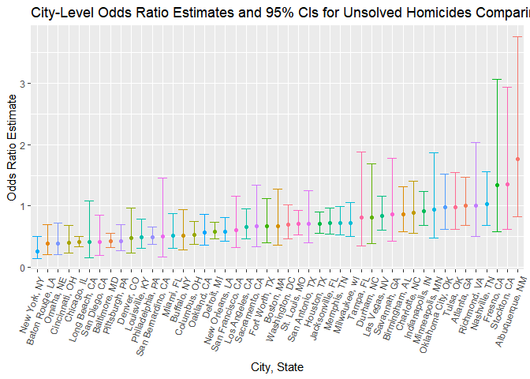

P8105 Data Science I Homework 6
================
Olivia Wang (hw2852)
2022-12-03

In preparation for the problems below, we will load the following
libraries:

``` r
library(tidyverse)
```

    ## ── Attaching packages ─────────────────────────────────────── tidyverse 1.3.2 ──
    ## ✔ ggplot2 3.3.6      ✔ purrr   0.3.4 
    ## ✔ tibble  3.1.8      ✔ dplyr   1.0.10
    ## ✔ tidyr   1.2.0      ✔ stringr 1.4.1 
    ## ✔ readr   2.1.2      ✔ forcats 0.5.2 
    ## ── Conflicts ────────────────────────────────────────── tidyverse_conflicts() ──
    ## ✖ dplyr::filter() masks stats::filter()
    ## ✖ dplyr::lag()    masks stats::lag()

``` r
library(readxl)
library(dplyr)
```

# Problem 1

# Problem 2

## 2.1 Homicide Data Import and Cleaning

Let us begin by importing the CSV file containing *Washington Post’s*
homicide data downloaded from GitHub, and applying the `clean_names`
function. Next, we can create a new `city_state` variable
(e.g. “Baltimore, MD”) by joining the existing city and state variables
using the `paste` command, and a new binary `homicide_solved` variable
indicating whether a homicide is solved. The `victim_age` variable
previously read as a character variable is transformed into a numeric
variable. Finally, we filtered the data to exclude information from
Dallas, TX, Phoenix, AZ, Kansas City, MD, and Tulsa, AL, and to only
include victims whose reported race was White or Black.

``` r
homicide_data = 
  read_csv("./homicide-data.csv") %>% 
  janitor::clean_names() %>% 
  mutate(city_state = as.character(paste(city, state, sep = ", ")), 
         homicide_solved = ifelse(disposition == "Closed by arrest", 1, 0), 
         victim_age = as.numeric(victim_age)) %>% 
  filter(!(city_state %in% c("Dallas, TX", "Phoeniz, AZ", "Kansas City, MO", "Tulsa, AL")), 
         victim_race %in% c("White", "Black"))
```

    ## Rows: 52179 Columns: 12
    ## ── Column specification ────────────────────────────────────────────────────────
    ## Delimiter: ","
    ## chr (9): uid, victim_last, victim_first, victim_race, victim_age, victim_sex...
    ## dbl (3): reported_date, lat, lon
    ## 
    ## ℹ Use `spec()` to retrieve the full column specification for this data.
    ## ℹ Specify the column types or set `show_col_types = FALSE` to quiet this message.

    ## Warning in mask$eval_all_mutate(quo): NAs introduced by coercion

## 2.2 Homicide Data Analysis: Odds Ratios & 95% CIs

#### *Solved Homicides Comparing Male & Female Victims in Baltimore, MD*

Below we use the `glm` function to estimate the odds ratio of solved
homicides comparing male to female victims, specifically in Baltimore,
MD, adjusting for age and race. The arguments for the `glm` function
indicate that the `homicide_solved` variable is the outcome of interest,
and `victim_age`, `victim_sex` and `victim_race` are the predictors.

The output generated from the `glm` function is then saved as an R
object. The `broom::tidy()` function was applied to tidy the output, and
the log odds ratios, odds ratios, and p-value corresponding to each term
in the regression model were pulled and tabulated. In the final step,
the `confint` function was applied to the output generated from the
`glm` function to generate the 95% confidence intervals surrounding the
odds ratios.

``` r
homicide_data_df = homicide_data %>% 
  filter(city_state == "Baltimore, MD")

glm_homicide_baltimore = 
  homicide_data_df %>% 
  glm(homicide_solved ~ victim_age + victim_sex + victim_race, data = ., family = binomial())

glm_homicide_baltimore %>%
  broom::tidy() %>%
  mutate(odds_ratio = exp(estimate), 
         lower_CI = exp(estimate - 1.96*std.error), 
         upper_CI = exp(estimate + 1.96*std.error)) %>%
  select(term, odds_ratio, lower_CI, upper_CI) %>% 
  filter(term == "victim_sexMale") %>% 
  knitr::kable(col.names = c('Term', 'Odds Ratio', 'Lower 95% CI Limit', 'Upper 95% CI Limit'), digits = 3)
```

| Term           | Odds Ratio | Lower 95% CI Limit | Upper 95% CI Limit |
|:---------------|-----------:|-------------------:|-------------------:|
| victim_sexMale |      0.426 |              0.325 |              0.558 |

In Baltimore, MD, the odds ratio of solving homicides comparing male
victims to female victims, adjusting for age and race, was 0.456. We are
95% confident that the true odds ratio of solving homicides comparing
male and female victims, adjusting for age and race, lies between 0.340
and 0.612.

#### *Solved Homicides Comparing Male & Female Victims in All Cities*

We will now apply the `glm` function to all cities in the data set. This
process involves first creating a new `glm_homicide` function, which
applies the `glm` function to selected inputs. We then use the `select`
function to reorder the columns in the data frame to have `city_state`
appear first, as the function will be mapped to each unique
`city_state`. The city-level homicide data will then be nested using the
`nest` function to generate list columns for city-level homicide counts,
and the `glm_homicide` function will be mapped to each tibble using
`purrr::map`. Finally, we apply the `unnest` function to generate the
city-specific odds ratio and 95% CIs.

``` r
glm_homicide = function(homicide_data) {
  glm(homicide_solved ~ victim_age + victim_sex + victim_race, data = homicide_data, family = binomial()) %>% 
  broom::tidy() %>%
  mutate(odds_ratio = exp(estimate), 
         lower_CI = exp(estimate - 1.96*std.error), 
         upper_CI = exp(estimate + 1.96*std.error)) %>%
  select(term, odds_ratio, lower_CI, upper_CI) %>% 
  filter(term == "victim_sexMale")
}

homicide_data_analysis = homicide_data %>% 
  select(city_state, everything()) %>% 
  nest(data = uid:homicide_solved) %>% 
  mutate(glm_homicide_output = purrr::map(.x = data, ~ glm_homicide(.x))) %>% 
  unnest(cols = glm_homicide_output)
```

#### *Plotting City-Specific Solved Homicides Comparing Male & Female Victims*

using the generated output from the analysis above, we will plot the
city-level odds ratio estimates of unsolved homicides comparing male to
female victims and corresponding 95% CIs using `ggplot`. In addition to
plotting the OR estimates using `geom_point`, the 95% confidence
intervals associated with each estimate were applied using
`geom_errorbar`. Cities are ordered in increasing OR estimates of
unsolved homicides, comparing male to female victims.

``` r
homicide_data_analysis %>% 
  ggplot(aes(x = reorder(city_state, odds_ratio), y = odds_ratio, color = city_state)) + 
  geom_point() +
  geom_errorbar(aes(ymin = lower_CI, ymax = upper_CI)) +
  labs(
    title = "City-Level Odds Ratio Estimates and 95% CIs for Unsolved Homicides Comparing Male to Female Victims", 
    x = "City, State", 
    y = "Odds Ratio Estimate") + 
  theme(
    axis.text.x = element_text(angle = 70, hjust = 1), 
    legend.position = "none")
```

<!-- -->

# Problem 3

## 3.1 Birth Weight Data Import and Cleaning

Let us begin by importing the CSV file containing birth weight data, and
applying the `clean_names` function

``` r
birthweight_data = 
  read_csv("./birthweight.csv") %>% 
  janitor::clean_names() %>% 
  mutate(babysex = factor(babysex, labels = c("Male", "Female")),
         fincome = fincome * 100, 
         frace = factor(frace, labels = c("White", "Black", "Asian", "Puerto Rican", "Other")),
         malform = factor(malform, labels = c("Absent", "Present")),
         mrace = factor(mrace, labels = c("White", "Black", "Asian", "Puerto Rican")))
```

    ## Rows: 4342 Columns: 20
    ## ── Column specification ────────────────────────────────────────────────────────
    ## Delimiter: ","
    ## dbl (20): babysex, bhead, blength, bwt, delwt, fincome, frace, gaweeks, malf...
    ## 
    ## ℹ Use `spec()` to retrieve the full column specification for this data.
    ## ℹ Specify the column types or set `show_col_types = FALSE` to quiet this message.

``` r
skimr::skim(birthweight_data)
```

|                                                  |                  |
|:-------------------------------------------------|:-----------------|
| Name                                             | birthweight_data |
| Number of rows                                   | 4342             |
| Number of columns                                | 20               |
| \_\_\_\_\_\_\_\_\_\_\_\_\_\_\_\_\_\_\_\_\_\_\_   |                  |
| Column type frequency:                           |                  |
| factor                                           | 4                |
| numeric                                          | 16               |
| \_\_\_\_\_\_\_\_\_\_\_\_\_\_\_\_\_\_\_\_\_\_\_\_ |                  |
| Group variables                                  | None             |

Data summary

**Variable type: factor**

| skim_variable | n_missing | complete_rate | ordered | n_unique | top_counts                              |
|:--------------|----------:|--------------:|:--------|---------:|:----------------------------------------|
| babysex       |         0 |             1 | FALSE   |        2 | Mal: 2230, Fem: 2112                    |
| frace         |         0 |             1 | FALSE   |        5 | Whi: 2123, Bla: 1911, Pue: 248, Asi: 46 |
| malform       |         0 |             1 | FALSE   |        2 | Abs: 4327, Pre: 15                      |
| mrace         |         0 |             1 | FALSE   |        4 | Whi: 2147, Bla: 1909, Pue: 243, Asi: 43 |

**Variable type: numeric**

| skim_variable | n_missing | complete_rate |    mean |      sd |     p0 |     p25 |     p50 |     p75 |   p100 | hist  |
|:--------------|----------:|--------------:|--------:|--------:|-------:|--------:|--------:|--------:|-------:|:------|
| bhead         |         0 |             1 |   33.65 |    1.62 |  21.00 |   33.00 |   34.00 |   35.00 |   41.0 | ▁▁▆▇▁ |
| blength       |         0 |             1 |   49.75 |    2.72 |  20.00 |   48.00 |   50.00 |   51.00 |   63.0 | ▁▁▁▇▁ |
| bwt           |         0 |             1 | 3114.40 |  512.15 | 595.00 | 2807.00 | 3132.50 | 3459.00 | 4791.0 | ▁▁▇▇▁ |
| delwt         |         0 |             1 |  145.57 |   22.21 |  86.00 |  131.00 |  143.00 |  157.00 |  334.0 | ▅▇▁▁▁ |
| fincome       |         0 |             1 | 4410.53 | 2597.57 |   0.00 | 2500.00 | 3500.00 | 6500.00 | 9600.0 | ▃▇▅▂▃ |
| gaweeks       |         0 |             1 |   39.43 |    3.15 |  17.70 |   38.30 |   39.90 |   41.10 |   51.3 | ▁▁▂▇▁ |
| menarche      |         0 |             1 |   12.51 |    1.48 |   0.00 |   12.00 |   12.00 |   13.00 |   19.0 | ▁▁▂▇▁ |
| mheight       |         0 |             1 |   63.49 |    2.66 |  48.00 |   62.00 |   63.00 |   65.00 |   77.0 | ▁▁▇▂▁ |
| momage        |         0 |             1 |   20.30 |    3.88 |  12.00 |   18.00 |   20.00 |   22.00 |   44.0 | ▅▇▂▁▁ |
| parity        |         0 |             1 |    0.00 |    0.10 |   0.00 |    0.00 |    0.00 |    0.00 |    6.0 | ▇▁▁▁▁ |
| pnumlbw       |         0 |             1 |    0.00 |    0.00 |   0.00 |    0.00 |    0.00 |    0.00 |    0.0 | ▁▁▇▁▁ |
| pnumsga       |         0 |             1 |    0.00 |    0.00 |   0.00 |    0.00 |    0.00 |    0.00 |    0.0 | ▁▁▇▁▁ |
| ppbmi         |         0 |             1 |   21.57 |    3.18 |  13.07 |   19.53 |   21.03 |   22.91 |   46.1 | ▃▇▁▁▁ |
| ppwt          |         0 |             1 |  123.49 |   20.16 |  70.00 |  110.00 |  120.00 |  134.00 |  287.0 | ▅▇▁▁▁ |
| smoken        |         0 |             1 |    4.15 |    7.41 |   0.00 |    0.00 |    0.00 |    5.00 |   60.0 | ▇▁▁▁▁ |
| wtgain        |         0 |             1 |   22.08 |   10.94 | -46.00 |   15.00 |   22.00 |   28.00 |   89.0 | ▁▁▇▁▁ |
